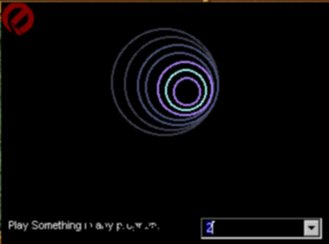



## Sound Visualization

### Description

Shows a colorful visualisation based music played.

I found here a code that shows a graphic EQ,but

mine does not show it on progress bars - but gives

a base example for true visualization.(like plug-ins for winamp) this is good for all writing Sound

playing apps.
 
### More Info
 
Something like an MP3 file should be playing in the background.

             |
---                |---
**Submitted On**   |2000-07-25 21:59:14
**By**             |[ShookyN@GAR](https://github.com/Planet-Source-Code/PSCIndex/blob/master/ByAuthor/shookyn-gar.md)
**Level**          |Advanced
**User Rating**    |4.0 (12 globes from 3 users)
**Compatibility**  |VB 5\.0, VB 6\.0
**Category**       |[Sound/MP3](https://github.com/Planet-Source-Code/PSCIndex/blob/master/ByCategory/sound-mp3__1-45.md)
**World**          |[Visual Basic](https://github.com/Planet-Source-Code/PSCIndex/blob/master/ByWorld/visual-basic.md)
**Archive File**   |[CODE\_UPLOAD81467252000\.zip](https://github.com/Planet-Source-Code/shookyn-gar-sound-visualization__1-10058/archive/master.zip)

